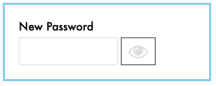

# Javascript DOM Manipulations - Password Revealer

### Task Description
Create a UI component that allows a user to toggle the revealed password.

### Demo

### Keys to Success:
- The changing color of the eye icon is caused by adding/removing the class `pw-hidden` from the `<button>` element in the `index.html`. 
- You will need to change the value for `type` property on the `input` element from `"password"` to `"text"`  